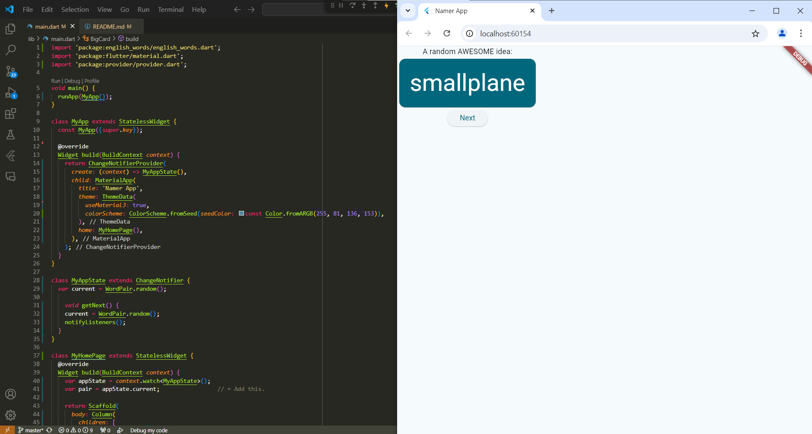

# Praktikum Aplikasi Pertama dan Widget Dasar Flutter

#### Nama    : Jihan Karunia Putri
#### NIM     : 2241720031
#### Kelas   : TI-3B
#### Absen   : 13

## Praktikum 1: Membuat Project Flutter Baru

## Praktikum 3: Membuat Repository GitHub dan Laporan Praktikum
### Membuat Repository GitHub

### Tampilan Aplikasi Flutter Pertama

## Praktikum 4: Menerapkan Widget Dasar
### Text Widget

### Image Widget

## Praktikum 5: Menerapkan Widget Material Design dan iOS Cupertino
### Cupertino Button dan Loading Bar

### Floating Action Button (FAB)

### Scaffold Widget

### Dialog Widget

### Input dan Selection Widget

### Date and Time Pickers

## Codelabs: Your first Flutter app
### Menambahkan Tombol

### Memperindah Tampilan Aplikasi
*Menambahkan Kartu*

*Tema dan Gaya*

*TextTheme*

*Menempatkan UI di tengah*

### Menambahkan Fungsi
*Menambahkan tombol*

### Menambahkan Kolom Samping Navigasi

*Menggunakan selectedIndex*

*Tingkat Respon*

### Menambahkan Halaman Baru

